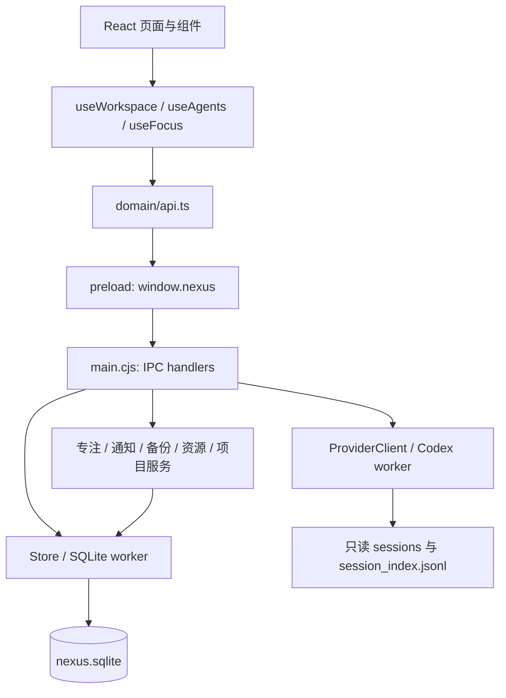

# 项目开发接续说明

核对日期：2026-10-08。当前版本 `0.4.0`，本轮工作流已与远端 `c1a7d42` / `0.3.11` 的素材、播放器和跨机器开发规则整合。工作目录：`D:\ProjectNia\nexus-companion`。完整 harness、打包程序复测、便携 EXE 与归档审计均已通过，版本标签为 `v0.4.0`；具体产物和哈希见 PROJECT_STATUS.md。

先读根目录 [AGENTS.md](../AGENTS.md)；跨机器启动见 [START_ON_NEW_PC.md](START_ON_NEW_PC.md)。本文的源码说明已按 0.4.0 更新，第 7 节的机器路径和安装工具仍是历史环境记录，不能直接套用到另一台电脑。

本文基于现有源码、配置、测试和发布文件整理，用于后续在本机继续开发。当前发布验收见 VERIFICATION.md；本次已实现的优化与后续候选项分别记录。修改功能后应同步更新相关说明。

0.4.0 将灵感、任务、时间安排和专注连成工作流：灵感草稿自动保存、保存后定位、一键转任务；首页优先显示今日与逾期任务及下一项日程；每日三项重点和收工回顾；任务用时自动累计；项目下一步自动保存；Nia 紧凑栏避免覆盖内容。以下记录当前实现，不将正在运行的测试写成已通过。

## 1. 产品与当前范围

Nexus Companion 是面向 Windows 的本地桌面工作中枢，组合项目、任务、日历、Codex 会话观测、笔记、日报、专注计时和 Nia 伙伴。

- 应用没有独立账号系统、云同步、遥测或模型请求。外部链接通过系统浏览器打开。
- Codex 集成读取本地会话文件，展示最近观测；没有发送提示、创建会话、停止、重试、实时审批能力。
- Nia 保留已接受的 idle 图集与播放顺序；其余七种状态使用独立 24 格候选图集。一次显示一个完整格子，图集预解码后推进时间轴，并支持八状态静态立绘和显示模式持久化。只有 idle 已获用户视觉接受，其他七组仍待接受，不能用测试通过代替艺术判断。Core 和自定义角色包继续支持；Live2D / Spine 尚未接入。
- 日历支持本地重复系列，不支持单次例外、外部日历同步或显式时区管理。
- 安装版和便携版均以本地数据目录为基础；便携版默认数据并不跟随 EXE 保存。

用户操作见 [USER_GUIDE.md](USER_GUIDE.md)，原架构说明见 [ARCHITECTURE.md](ARCHITECTURE.md)。本文补充源码细节及本机现状。

## 2. 技术栈与目录

`package-lock.json` 锁定的主要版本如下；安装时应使用锁文件，而非根据 `package.json` 的版本范围重新选版本。

| 层次       | 技术 / 锁定版本                           | 主要位置                          |
| ---------- | ----------------------------------------- | --------------------------------- |
| 桌面宿主   | Electron 39.8.10，CommonJS                | `electron/main.cjs`               |
| 界面       | React / React DOM 19.3.0                  | `src/main.tsx`、`src/ui/App.tsx`  |
| 类型与构建 | TypeScript 5.9.3、Vite 6.4.3              | `tsconfig.json`、`vite.config.ts` |
| 数据       | Node 内置 `node:sqlite`，WAL              | `electron/storage/`               |
| 桌面回归   | Playwright 1.63.0                         | `tests/*.cjs`                     |
| 打包       | electron-builder 26.15.3，NSIS / portable | `package.json`                    |
| 文本与图标 | react-markdown、lucide-react              | 各功能组件                        |

源码大致分为：

```text
src/
  main.tsx                 React 入口与全局样式加载顺序
  ui/                      应用外壳、导航、各功能 CSS
  features/                九个业务页面
  components/              弹窗、实体表单、搜索、快速记录、首次引导、日志列表
  domain/                  通用类型、接口、工作区状态、日历算法、日报、翻译
  providers/               Agent 观测状态与轮询
  avatar/                  单格裁剪、预解码、逐格播放、立绘、预览、菜单
electron/
  main.cjs                 生命周期、接口分发、托盘、快捷键、后台调度
  preload.cjs              window.nexus 桥接
  storage/                 数据库线程、输入校验、数据目录迁移
  providers/               Codex 适配器及线程封装
  services/                项目、资源、备份、专注、通知
  generated/calendar.cjs   从领域源码生成的 Node 端日历逻辑
scripts/                   构建、环境/素材契约、harness、受限发布清理、打包收尾、Electron 下载
tests/                     单元测试及桌面验收
public/assets/             Nia 图片与应用图标
art/                       受保护 idle、历史原图、七组候选源页/单格、提示词与 manifest
res/Nia.png                受保护的用户角色设计参考
docs/                      架构、用户手册、发布记录等
```

`build/` 是 Vite 界面产物；`dist/` 是安装包输出；两者不可混淆。`node_modules/`、`build/`、`dist/`、`.test-data/` 均被 Git 忽略。根 `AGENTS.md` 随 Git 版本化，规定素材保护、隔离测试和发布清理边界；已有 Prettier 配置。

## 3. 运行与数据流



### 启动流程

1. 设置应用名及可选 `NEXUS_DATA_DIR`，获取单实例锁。
2. 读取数据位置配置，必要时迁移数据并确定实际数据根目录。
3. 创建 SQLite worker，读取 Codex 连接配置，初始化专注和通知状态。
4. 注册接口，创建带隔离和沙箱的 Electron 窗口。
5. 加载 `NEXUS_DEV_URL` 指向的开发页面，或 `build/index.html`。
6. 正常模式下注册托盘与全局快捷键；关闭窗口时隐藏到托盘，后台调度继续。

### 界面状态

- 页面由 `App.tsx` 的 `page` 状态选择，没有独立路由库或外部状态管理库。
- `useWorkspace` 加载七个集合；每次保存或删除后重新加载全部七个集合。
- 外观配置单独存于 `settings/appearance`，由 `App.tsx` 持有。
- `useDraft` 将笔记和快速记录草稿写入 `settings`，按草稿键串行写入并用 revision 防止旧编辑器清除新草稿。
- 每日计划按本地日期独立保存；Home 的自动保存队列跨页面重新挂载保持顺序。项目“下次第一步”延迟 500 ms 保存，失焦或离开页面时提交待保存内容。
- `useAgents` 每轮读取结束后等待 15 秒再读取；窗口聚焦和连接设置变化时强制刷新。主进程也每 15 秒扫描，使用 10 秒缓存与正在执行的请求合并来减少重复读取。
- 专注计时由主进程每秒检查；界面每秒读取状态。计时不依赖页面是否打开。

### 接口约定

渲染端调用 `api(method, ...args)`，经 `window.nexus.call` 进入唯一的 `nexus` IPC 通道。主进程检查发送窗口与方法白名单，返回 `{ ok, data }` 或 `{ ok: false, error }`；`api()` 将失败转换为异常。

| 接口组     | 代表方法                                                                                                  |
| ---------- | --------------------------------------------------------------------------------------------------------- |
| 数据       | `list`、`save`、`delete`                                                                                  |
| Agent      | `agents`、`agentLogs`、`connectionInfo`、`configureConnection`                                            |
| 项目与系统 | `projectInspect`、`projectOpen`、`openDocument`、`openUrl`、`chooseDirectory`                             |
| 专注与通知 | `focusState`、`focusStart`、`focusPause`、`focusStop`、`notify`                                           |
| 资源       | `asset`、`importBackground`、`importAvatar`                                                               |
| 数据维护   | `backupExport`、`backupPreview`、`backupRestore`、`integrity`                                             |
| 应用维护   | `info`、`windowVisible`、`chooseDataLocation`、`cancelDataLocation`、`restart`、`openLogs`、`clientError` |

新增系统能力时，入口在主进程白名单与对应服务；React 页面不直接访问文件系统。现有桥接和多数实体仍使用宽泛类型，接口名称、参数和返回值尚未形成完整的静态类型约束。

## 4. 功能修改入口

| 功能          | 主要文件                                                                                       | 需要一起考虑的行为                                                     |
| ------------- | ---------------------------------------------------------------------------------------------- | ---------------------------------------------------------------------- |
| 工作台        | `src/features/home/Home.tsx`、`src/domain/planning.ts`                                         | 今日与逾期、显式重新安排、下一日程、三项重点、容量、自动保存回顾       |
| 项目          | `src/features/projects/Projects.tsx`、`electron/services/projects.cjs`                         | 下一步自动保存、关联任务和灵感、继续专注、目录检测与只读 Git           |
| 任务          | `src/features/tasks/Tasks.tsx`                                                                 | 六状态、排序、筛选、`completedAt`、安排到日历                          |
| 日历          | `src/features/calendar/Calendar.tsx`、`src/domain/calendar.ts`                                 | 重复展开、月末、跨夜、重叠分栏、拖放、15 分钟步长调整                  |
| Agent         | `src/features/agents/Agents.tsx`、`src/providers/useAgents.ts`、`electron/providers/codex.cjs` | 文件格式、观测时间、缓存、角色与置顶、日志上限                         |
| 时间线 / 日报 | `src/features/timeline/Timeline.tsx`、`src/domain/report.ts`、`electron/main.cjs`              | 事件写入、日期与项目过滤、日报统计范围                                 |
| 笔记          | `src/features/notes/Notes.tsx`、`src/domain/useDraft.ts`                                       | 草稿恢复、保存定位、转任务及来源链接、Markdown、搜索                   |
| 专注          | `src/features/focus/Focus.tsx`、`electron/services/focus.cjs`、`electron/storage/worker.cjs`   | 全局计时条、暂停与恢复、事务累计任务用时、完成后的显式选择             |
| 设置          | `src/features/settings/`                                                                       | 外观、语言、连接、资源导入、备份与数据迁移                             |
| 伙伴          | `src/domain/avatar.ts`、`src/avatar/`、`src/ui/avatar.css`                                     | 状态时效、图集帧序列、播放/暂停、预览、快捷菜单；详见 NIA_ANIMATION.md |
| 通用交互      | `src/components/`                                                                              | Modal 关闭与焦点恢复、EntityForm 时间戳、搜索与快速记录                |

样式在 `src/main.tsx` 按固定顺序导入；`notes.css`、`planning.css`、`workflow.css` 在 `light.css` 之后补充新工作流布局。外观修改需要同时检查深浅主题、背景透明度和较窄窗口。桌面窗口最小尺寸是 1060 × 720；小于 1200 CSS 像素宽度时，伙伴使用独立窄栏，不再悬浮覆盖正文。宽窗口可手动收起伙伴栏并保存偏好。

## 5. 数据模型与持久化

数据库并非每个业务实体一张表，而是 `records(kind, id, data)` 通用记录表，以 `(kind, id)` 为主键，`data` 保存 JSON。另有 `meta` 表，目前仅初始化 `schema=1`；尚无逐版本迁移执行器。

| 集合       | 内容 / 关系                                                                 |
| ---------- | --------------------------------------------------------------------------- |
| `projects` | `name`、绝对 `projectPath`、引擎、仓库、外观、`nextStep`                    |
| `tasks`    | 状态、优先级、日期、排序、分钟时长、`project`、`sourceNote`、Agent 关联文本 |
| `events`   | `start/end`、重复规则、`project`、`relatedTask`                             |
| `notes`    | 标题、Markdown、标签、`project`                                             |
| `focus`    | 已结束的专注记录，实际时长以秒保存                                          |
| `timeline` | 本地实体操作与已提取的 Agent 活动                                           |
| `reports`  | 按日期 ID 保存的日报 Markdown 快照                                          |
| `agents`   | 最近扫描结果的持久化副本；界面列表仍来自适配器扫描                          |
| `settings` | 外观、连接、角色标注、草稿、每日计划、记录类型、运行中专注和通知去重状态    |

主要 settings ID：

- `appearance`：主题、语言、图片、Avatar Pack、`avatarMotion` 动画开关、`avatarDisplay` 动画/立绘模式、伙伴紧凑偏好、通知开关、首次引导状态。
- `codex-connection`：读取是否启用、自定义 Codex 根目录。
- `agent-profiles`：按真实会话 ID 保存显示名、角色与置顶。
- `active-focus`：运行中专注状态；不等同于已结束的 `focus` 记录。
- `notification-ledger`：通知去重键，最多保留 1000 个。
- `draft:note:new` / `draft:note:<id>`：新建或现有笔记草稿；`draft:capture`：快速记录草稿。
- `capture-preferences`：上次成功保存的记录类型；首次默认 `notes`。
- `daily-plan:YYYY-MM-DD`：对应本地日期的最多三项重点、可用分钟数、开工/收工时间和回顾正文。

关系由 JSON 中的 ID 字段表达，没有数据库外键和级联删除。删除项目目前不会自动删除或解除相关任务、日程、笔记的关联。`EntityForm` 会补充创建/修改时间，但直接调用存储接口的其他路径不统一补充这些字段。

默认数据根目录为 `%APPDATA%\Nexus Companion`，包含数据库、`assets/`、`logs/` 和 `backups/`。`data-location.json` 位于 Electron 的基础 userData 目录，记录 active / pending 路径。迁移复制数据库快照及资源、备份、日志，校验后切换；保留旧目录并拒绝覆盖已存在目标。

备份是带 SHA-256 的 JSON `.nexus` 文件，不是 SQLite 文件副本，也不加密。它包含项目、任务、日程、笔记、已结束专注、时间线和日报，以及允许导出的设置与引用图片。0.4.0 的设置白名单包含 `appearance`、`agent-profiles`、`capture-preferences`、合法日期键的每日计划、笔记/快速记录草稿；不导出 `agents` 缓存、Codex 源文件、连接配置、运行中专注状态或通知去重账本。已写入时间线的 Agent 活动仍属于备份内容。恢复时同 ID 覆盖、其他记录保留，数据库合并使用事务，恢复前生成快照。

## 6. 容易误解的实现边界

### Codex 观测

- 路径来自连接设置、`CODEX_HOME` 或用户目录 `.codex`，只读取 `sessions` 和 `session_index.jsonl`。
- 按目录/文件名倒序遍历，最多发现 120 个 JSONL 文件，再按线程 ID 去重、按观测时间排序；并不是遍历全部历史后按修改时间挑选 120 个。
- 每个文件读取头部 256 KB 元数据及尾部 2 MB，按文件大小和修改时间缓存；日志保留末尾 1500 条，活动保留末尾 200 条。
- 当前解析器实际产生 `RUNNING`、`COMPLETED`、`FAILED`、`CANCELLED`、`UNAVAILABLE`。界面和类型中的 WAITING / WAITING_APPROVAL 等预留状态不代表当前适配器已能识别审批。
- 两分钟没有新观测的 RUNNING 降为 UNAVAILABLE；只有同时有有效开始、结束记录才计算时长。日报仅统计可见最近轮次。
- 本地显示名与角色来自 `agent-profiles`，不是底层模型或 Agent 身份的自动识别结果。

### 日历、专注与伙伴

- 日历保存本地日期时间字符串，使用 JavaScript 本地 `Date` 计算；不是携带 IANA 时区的日程模型。
- 修改、移动或调整重复日程会更改整个系列。修改领域算法后应重新生成 `electron/generated/calendar.cjs`，通知服务也依赖它。
- 专注时长支持 1–480 分钟，暂停保存剩余秒数；运行中通过 deadline 恢复。正常完成或提前结束时，记录、关联任务 `actualTime` 增量和活动计时状态清理在同一 SQLite 事务内提交，同一专注记录不会重复累计。秒数转换为分钟，因此实际时长可能有小数；原有手填用时保留。
- 修改任务时，`actualTimeBaseline` 与编辑请求标识用于保护编辑期间新增的专注用时，并防止重试重复累计。旧版本已结束的专注不追溯回填。专注结束不会自动将任务改为完成；由用户选择完成、继续或休息。
- Nia 状态优先级是失败 → 审批 → 工作/专注 → 等待 → 近期完成 → 深夜 → 空闲。失败状态保留五分钟，活动观测和完成反馈保留两分钟；每 15 秒更新状态，避免旧记录持续影响当前表情。
- idle 源帧、运行图集哈希、帧序列 `[0,2,...,22]`、首格 700 ms 和其余 115 ms 均受保护。七组候选源页/单格位于 `art/nia-state-hires/`，运行图集位于 `public/assets/nia/animations-hires/`；只能从原格对整张画面统一缩放和平移，禁止脸部补丁、局部形变、插帧、交叉淡化或反复重采样。
- 连续 idle/working/thinking/sleepy 状态循环，完成与警告反应播放一次后停留。`AvatarPreview` 展示触发语义并提供动画/立绘选择；公开绘制资料、源页计数和固定锚点指标不等于用户视觉验收。详见 `AGENTS.md` 与 `NIA_ANIMATION.md`。
- `Home.tsx` 中有 WidgetDefinition 和 widgets 声明，但当前布局是固定 JSX，尚无组件排序/显隐设置。
- 快速记录提供「灵感 / 任务」类型选择和保存位置提示，首次默认灵感，之后沿用上次成功保存类型；`TODO` / `NOTE` 前缀优先决定类型。关闭保留草稿。主页「记录灵感」直接打开笔记编辑器，保存后打开并选中该笔记，清除可能隐藏它的旧筛选。
- 灵感转任务会保留原笔记，生成带 `sourceNote` 的关联任务；再次操作打开已有任务。任务和项目提供专注入口，开始前仍可确认时长；全局计时条提供跨页面查看、暂停与结束。
- 首页保留未完成的逾期、已开始及进行中任务；选入今日重点也会显示。仅「移到今天」操作才改写截止日期，开工、收工和选择重点均不自动改日期或完成状态。

## 7. 本机开发环境

以下工具链位置沿用此前在这台机器上的初始化记录，本次文档更新没有重新安装系统工具。开始新的开发会话时，应以 `doctor` 和实际命令可用性重新确认。

| 项目             | 本次检查结果                                                                               |
| ---------------- | ------------------------------------------------------------------------------------------ |
| 仓库             | `D:\ProjectNia\nexus-companion`，初始工作区干净                                            |
| Node             | 当前任务可调用 v24.19.0，来源为 Codex 自带运行时                                           |
| npm              | 系统未安装完整 npm；已校验并准备本项目临时 npm 12.0.2，位于 `.test-data/toolchain/package` |
| 依赖与构建目录   | 已按锁文件安装依赖，Electron 39.8.10 已按官方 SHA-256 校验；构建与发布目录已生成           |
| Git              | `D:\Git\cmd\git.exe` 可用                                                                  |
| VS Code          | `D:\Microsoft VS Code\Code.exe` 存在，`code.cmd` 在 PATH 中                                |
| Windows Terminal | `wt.exe` 启动入口在 PATH 中；未额外测试交互窗口                                            |
| 发布文件         | 0.4.0 安装版、便携版、解包程序与 SHA256SUMS 已生成并验证；仅清理识别到的旧版生成文件       |

Node 的当前位置为 `C:\Users\123\.cache\codex-runtimes\codex-primary-runtime\dependencies\node\bin\node.exe`。这是本次任务可用的运行时，不能据此认定用户另开的终端已经具备完整开发环境。

本次没有安装系统级工具。任务中已从官方 npm registry 下载并校验 npm，使用锁文件完成依赖安装，并手动补齐 npm 12 阻止自动执行的构建工具安装步骤。长期开发建议安装完整 Node.js 24+ 与 npm。当前机器也可按下面的临时工具链说明继续开发。

另一个已确认的本机兼容问题：`electron/services/projects.cjs` 的 VS Code 按钮只检查 LocalAppData / Program Files 默认位置，未使用 PATH，也不检查 D 盘；本机两个默认候选都不存在。后续应增加可配置路径或可靠的程序发现方式。

### 当前机器的临时 npm 工具链

以下只影响当前 PowerShell；`.test-data` 被忽略，不会推送到 Git。

```powershell
$env:PATH = (Join-Path (Get-Location) ".test-data\toolchain") + ";C:\Users\123\.cache\codex-runtimes\codex-primary-runtime\dependencies\node\bin;" + $env:PATH
$env:npm_config_cache = Join-Path (Get-Location) ".npm-cache"
npm.cmd --version
npm.cmd run doctor
```

重新安装依赖时若 npm 12 提示阻止安装脚本，可分别运行 `node node_modules/esbuild/install.js`、在 `node_modules/electron-winstaller` 中运行 `node script/select-7z-arch.js`、以及项目根目录的 `node scripts/download-electron.cjs`。仅使用已安装并核对来源的依赖脚本。

### 建议的本地开发启动步骤

准备好 Node / npm 后，在项目根目录运行：

```powershell
npm ci
npm run harness
$env:NEXUS_DATA_DIR = Join-Path (Get-Location) '.test-data\development'
npm start
```

隔离开发数据可避免调试写入日常使用的数据库。上述环境变量只作用于当前终端及其子进程。

需要热更新时，终端 A 运行：

```powershell
npm run dev
```

终端 B 在项目目录运行：

```powershell
$env:NEXUS_DATA_DIR = Join-Path (Get-Location) '.test-data\development'
$env:NEXUS_DEV_URL = 'http://127.0.0.1:5173'
npm start
```

单独打开 Vite 浏览器页面无法访问桌面数据桥接。首次仍建议完成一次 build；修改 Electron 主进程、preload、worker 后需要重启桌面进程，修改界面可使用热更新。

## 8. 验证与打包

| 命令                      | 范围                                                     |
| ------------------------- | -------------------------------------------------------- |
| `npm test`                | 执行 `tests/*.test.cjs`，包含新增规划及专注存储回归测试  |
| `npm run build`           | TypeScript 检查 → Node 日历模块生成 → Vite 构建          |
| `npm run harness`         | 环境、素材/项目契约、单元测试、构建与 Nia 桌面检查       |
| `npm run verify`          | 项目契约、3 个构建阶段、单元测试、16 组桌面测试          |
| `npm run smoke`           | 开发入口的 Electron 隐藏窗口启动检查，前提是已有构建产物 |
| `node tests/portable.cjs` | 直接执行现有 portable EXE，检查页面、桥接、引导和退出    |
| `npm run package`         | 重新构建并生成 NSIS 安装器与 portable EXE                |

`verify` 中的桌面套件为 desktop、m2–m8、e2e、polish、usability、nia、notes-flow、focus-flow、planning-flow、workflow。它不包含 `tests/portable.cjs`，也不自动完成安装器安装验收。

`npm run harness -- --full` 在环境与资源契约检查后运行完整 `verify`。`npm run package` 生成新包和配套文档，完成源码/归档审计后，才删除名称匹配规则的旧版安装器、便携版、blockmap、校验和及版本说明。`npm run verify:packaged` 执行七组打包桌面流程和实际便携 EXE 检查。不得递归清空 `dist`，不得将不受 Git 跟踪的目录当作临时垃圾。

`e2e.cjs`、`usability.cjs` 与 `nia.cjs` 可用 `NEXUS_PACKAGED_EXE` 指定已解包的应用测试。`NEXUS_TEST_MODE=1` 仅在未打包应用中用于跳过首次引导；完整用户路径测试保留首次引导。

当前 `verify` 为子进程设置隔离 `CODEX_HOME`；m4 和 polish 等需要会话内容的测试生成受控会话样例，不依赖个人真实会话。Nexus 数据也隔离在 `.test-data`。新增流程套件检查草稿与保存定位、专注用时和跨页计时、每日计划及项目续接；这描述测试范围，不等同于本次已经全部通过。

Electron 下载异常时，仓库提供从缓存恢复和下载的脚本，两者都校验官方包内的 SHA-256。它们需要 npm 依赖先就绪；不是 npm 缺失时的替代安装方式。当前 `doctor.cjs` 同样预期依赖已经安装。

本机本次打包遇到 GitHub 工具下载等待，使用已安装的 7-Zip 和 electron-builder 的镜像配置完成；哈希校验保持启用。复用已经构建好的程序时可运行：

```powershell
$env:ELECTRON_BUILDER_7ZIP_PATH = Join-Path (Get-Location) 'node_modules\electron-winstaller\vendor\7z-x64.exe'
$env:ELECTRON_BUILDER_CACHE = Join-Path (Get-Location) '.test-data\builder-cache'
$env:ELECTRON_BUILDER_BINARIES_MIRROR = 'https://npmmirror.com/mirrors/electron-builder-binaries/'
node node_modules/electron-builder/out/cli/cli.js --win nsis portable --prepackaged dist/win-unpacked
```

`--prepackaged` 只封装指定目录；修改源码后应先正常运行 `npm run package` 生成新程序，不能直接拿旧目录代替重建。

历史 0.3.1 实际验证（2026-09-21；不能作为 0.4.0 通过依据）：

- doctor 环境检查通过；完整自主 harness 的 16 个阶段全部通过，包括 20 项单元测试和 12 组桌面测试。
- Nia 专项覆盖主页笔记保存后跳转、查看/取消、重启后查找、唯一侧栏专注入口、八状态预览、帧推进、系统减少动态效果、窗口隐藏恢复、动画开关持久化、深浅主题、英文和最小宽度布局。验收截图保存在 .test-data。
- 受限执行环境会导致 Electron 渲染进程崩溃，真实桌面验收使用获准的非受限执行；数据仍隔离在 .test-data。
- 最终打包复测及文件哈希以 [VERIFICATION.md](VERIFICATION.md) / [PROJECT_STATUS.md](PROJECT_STATUS.md) 为准。安装器不会在验收中自动安装。
- 直接加载领域 TypeScript 单测时有 Node 模块类型提示，不影响结果。角色素材和实现详见 [NIA_ANIMATION.md](NIA_ANIMATION.md)。

本次 0.4.0 验证状态（2026-10-08）：与远端 0.3.11 整合后的 `harness --full` 通过，内部 verify 的 21 阶段包含项目契约、构建、35 项单元测试与 16 组桌面套件。另通过七组打包桌面流程和便携 EXE 检查；45 个应用文件与归档一致，审计 4,585 个条目。结果见 `.test-data/verification.json`、`packaged-verification.json` 和 `release-audit.json`；发布哈希见 PROJECT_STATUS.md。素材检查不能替代用户对七组候选动画的视觉接受。

## 9. 后续优化候选

以下按继续开发时的依赖顺序整理，不代表已经修复，也不替用户决定下一个功能目标。

| 方向           | 已观察到的实现                                                                                             | 后续处理入口                                            |
| -------------- | ---------------------------------------------------------------------------------------------------------- | ------------------------------------------------------- |
| 开发环境复现   | 已补齐项目工具链，整合后的 0.4.0 完整 harness 已通过；跨机器安装工具仍需自行确认                           | 长期开发准备完整 Node/npm，可进一步建立 CI              |
| 本机程序发现   | VS Code 安装在 D 盘，应用只检查两个默认位置                                                                | `electron/services/projects.cjs`                        |
| 后台数据刷新   | Agent 扫描会写数据库时间线，但 `useWorkspace` 只在初次加载和自身增删改后刷新；打开时间线页面也没有额外刷新 | 主进程变更通知或有针对性的刷新策略                      |
| Agent 详情更新 | 详情页保存打开时的 run 对象，日志仅在打开时读取；列表更新不会自动更新已有详情                              | `Agents.tsx` 的选择状态与日志刷新                       |
| 看板批量写入   | 一次拖动逐条保存整列任务，每条都刷新七个集合并写入时间线                                                   | 批量事务、一次刷新、区分排序与业务活动                  |
| 项目关联一致性 | 主进程 Agent→项目匹配只转小写，项目页还会统一斜杠；删除不清理引用                                          | 统一路径规范化及关联处理规则                            |
| 角色视觉验收   | 仅 idle 已接受；七组独立 24 格新动画为候选，单格播放器和立绘模式已合入                                     | 依规则逐格、接缝和实际显示尺寸复核，等待用户视觉接受    |
| 类型与数据演进 | 通用 Entity / IPC 大量使用 any，数据库只有 schema 标记                                                     | 按功能逐步定义实体/接口，新增字段时考虑旧数据和备份兼容 |
| 国际化与外观   | 仍有中文硬编码；浅色 CSS 覆盖部分透明度规则                                                                | 翻译覆盖、CSS 变量与视觉回归                            |
| 测试可复现性   | 已隔离 Codex 目录并提供固定会话样例；整合后 21 阶段及打包产物复测通过                                      | 继续分离受控回归与可选真实集成测试                      |

功能扩展如重复日程单次例外、可自定义工作台、Live2D / Spine、外部日历、可管理自有会话的 Agent 后端，均应作为独立需求设计，不应将当前预留接口或状态当作已接入功能。

## 10. 后续接续阅读顺序

1. 先检查 Git 当前状态，再读本文中的本机现状与验证范围。
2. 依据需求定位第 4 节的功能入口，沿界面 → API → handler → 服务/存储查阅。
3. 数据变化同时考虑校验、旧数据、关联字段、备份和迁移；日历变化记得重生成 Node 端模块。
4. 使用隔离数据目录进行有针对性的验证；发布前执行完整验收及现有打包程序检查。
5. 更新相关文档，明确区分本机验证、历史记录和仍未覆盖的行为。
