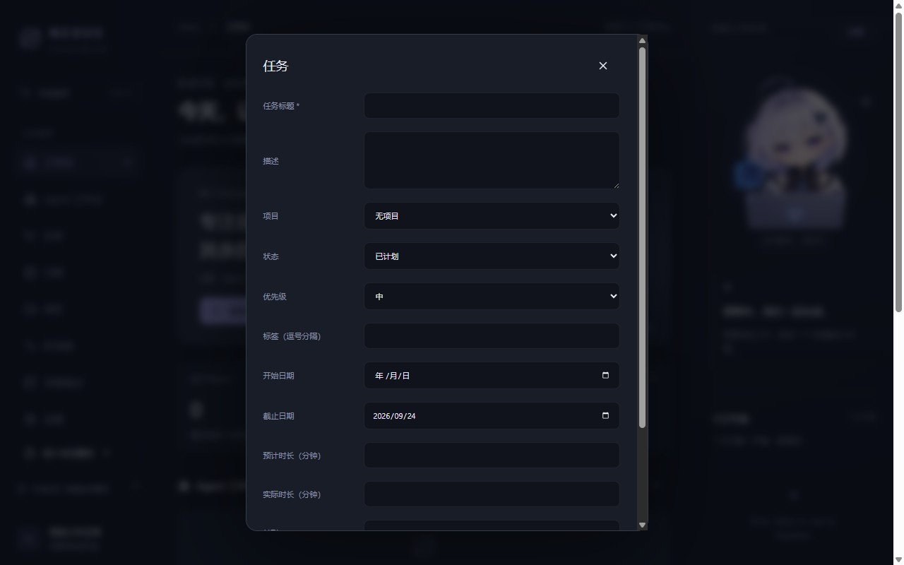
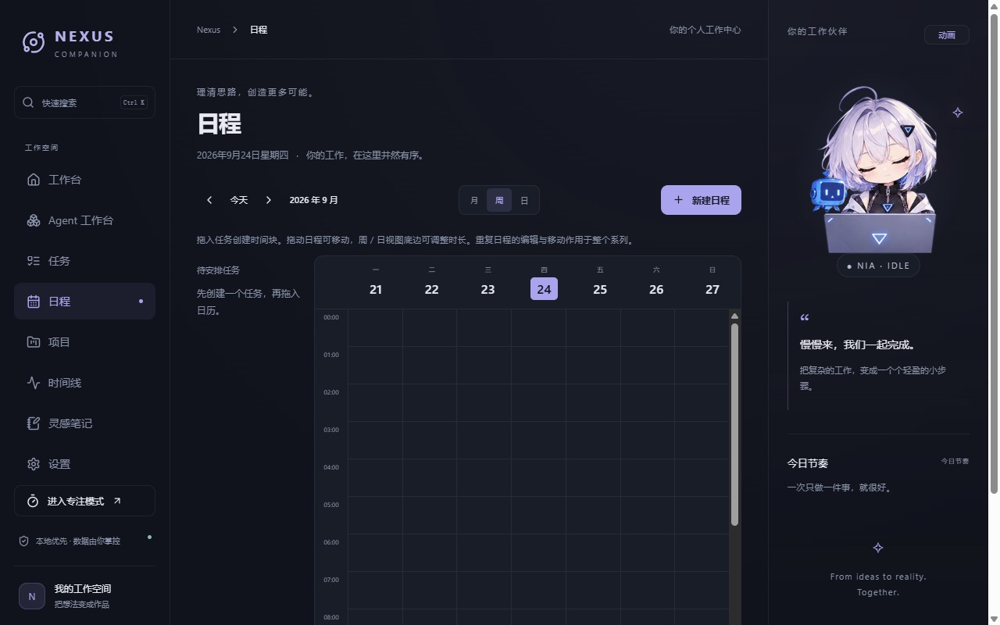
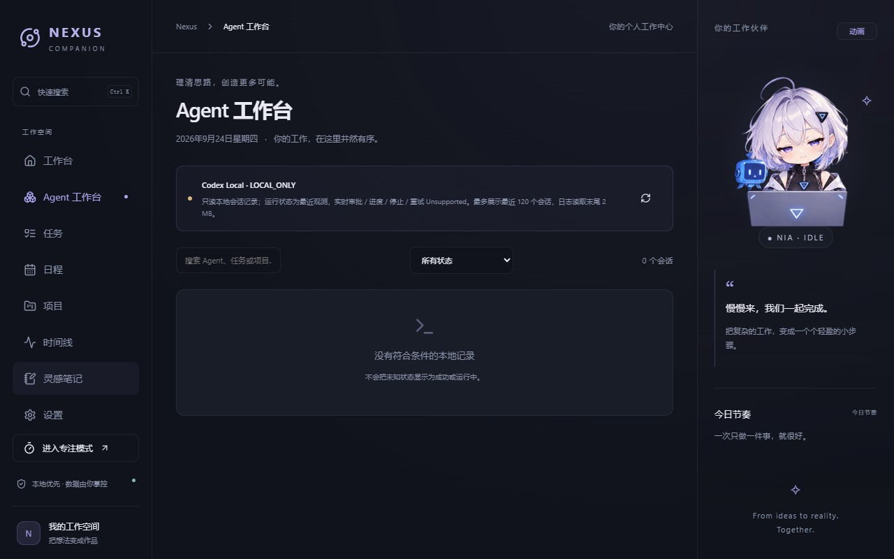

# Nexus Companion 实际使用体验检查（2026-09-24）

检查方式：在 Windows 上用 1280×800 窗口、新建的隔离数据目录运行 0.3.11，实际走了首次引导、工作台、项目、任务、日历、Agent、时间线、笔记、设置和专注入口，打开任务/项目/笔记表单；收集界面截图并检查渲染错误（本次为零）。这次没有接入真实 Codex 会话，也没有对用户的真实数据库、外部编辑器或系统通知做实机操作。以下是体验结论与建议，**本轮未开发新功能**。

## 优先处理的摩擦

1. **快速建任务并不快。** 从首页点“添加今日任务”后，完整表单一次展示描述、项目、状态、优先级、标签、两个日期、两个时长和两个 Agent 字段。1280×800 下连“保存”都在弹窗滚动区底部之外。建议首屏只保留标题、今天/截止日期和保存；其余放“更多选项”，保存按钮固定在弹窗底部。这样从“想到一件事”到“记录下来”只需输入标题和一次点击。见下图。
2. **专注的核心操作在首屏以下。** 进入专注页看到 Nia、倒计时和时长选择，真正的“开始专注”按钮在 800px 高窗口底部之外。右侧工作伙伴又展示一次 Nia，占用了工作区宽度。建议专注页优先显示“开始/暂停/结束”和当前任务；启动前减少重复装饰，必要时临时收起右侧栏。
3. **日历周视图先展示凌晨。** 进入“今天”的周视图，时间轴从 00:00 开始，白天的时间段要在内层滚动区向下寻找。建议首次进入滚到当前时间或工作时段，并加当前时间线；“今天”按钮也应回到当前时段。见下图。
4. **Agent 空状态缺少下一步。** 隔离环境下“Agent 工作台”显示 `0 个会话 / 没有符合条件的本地记录`。这无法区分目录没有记录、读取暂停、路径选错、还是筛选后结果为零；连接路径和检测数却在设置页。建议在空状态直接显示连接状态、最近读取时间和“检查 Codex 目录”入口。真实 Codex 接入仍只是本地会话只读观察。

## 下一轮可以评估的产品方向

| 顺序 | 建议 | 用户价值与边界 |
| --- | --- | --- |
| 高 | 打通“任务 → 安排时间 → 开始专注 → 完成回顾”的连续流程 | 当前四个页面各自能用，但新任务、日历、专注之间需要用户自己多次寻找和跳转。可以在任务卡提供“安排今天/开始专注”，专注结束回到原任务。先设计完整交互再开发。 |
| 高 | 正式设计 Codex 连接能力 | 首页强调 Agent，当前却只能读本地 JSONL，无法保证实时状态，也不能发送或审批。若要把它当核心卖点，应研究官方可用的 App Server 接口，先明确授权、失败状态和隐私，再决定是否接入；不要把现有只读状态包装成实时连接。 |
| 中 | 压缩空工作台首屏 | 首屏大幅品牌横幅后才出现真实任务、Agent 和日程。已有数据的用户更需要“下一件事”和当前异常；可以让横幅首次访问完整展示，此后缩小或折叠。 |
| 中 | 调整任务看板的可用宽度 | 1280px 时右侧角色栏常驻，六个状态分两行，单列约 220px。可提供收起右栏或让看板占主区全宽的布局，并验证长标题与多卡片场景。 |
| 中 | 设置页提供分组导航和检查状态 | 连接、备份、外观、角色、通知、数据位置都在一页长滚动中。常见的“查连接/备份/改语言”应能从页首直达，并保留当前位置。 |
| 低 | 精简可见的工程词和引导步骤 | 中文界面仍直接出现 `LOCAL_ONLY`、`Unsupported` 等工程词；未选项目目录时，引导仍经过“你的第一个项目”一步。可用直白状态说明替代缩写，并让跳过目录后的引导顺畅结束。 |

## 本次界面证据

这些建议是对当前版本的体验记录，不是已承诺的开发范围。尤其是 Codex 连接和跨设备数据同步，需要单独定义安全、权限和迁移规则。
